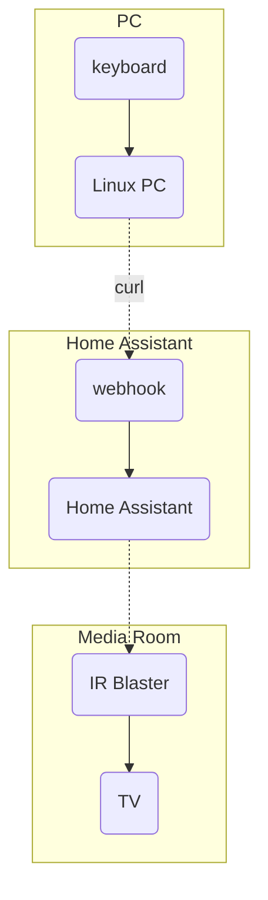

---
{"dg-publish":true,"tags":["automation","homeassistant"],"permalink":"/developer/home-assistant/computer-keyboard-key-to-trigger-home-assistant-webhook/","dgPassFrontmatter":true}
---

## The Automation Explained
I was looking for a way to hit a key on my media PC keyboard that turns on my TV in my living room. Webhooks are an `http` endpoint that make communication between apps easy. 


## Home Assistant
I have a *dumb* TV that is only controlled by IR. If you have a smart TV, I'm sure you got it setup to turn on/off with your home assistant. If not, check out this [RM4 mini](https://ebroadlink.com/products/broadlink-rm4-mini-universal-remote-wi-fi-ir-control-hub_certified-wwa-work-with-alexa_-black) to turn any IR controlled device into a *smart* one. This guide already assumes you have your TV is controlled by Home Assistant.
### Create the Webhook
The [HA docs](https://www.home-assistant.io/docs/automation/trigger/#webhook-trigger) show how to get started. I created my webhook directly in the HA UI as a new automation. Select `webhook` as an automation **trigger**. 

Keep note of the `WEBHOOK_ID`. It should look something like this

```shell
http://HOMEASSISTANT_IP:8123/api/webhook/WEBHOOK_ID
```

Test the endpoint in a terminal command like so

```shell
curl -X POST -d 'key=value&key2=value2' http://HOMEASSISTANT_IP:8123/api/webhook/WEBHOOK_ID
```
## PC Script
First thing is to create shell script on the **PC**. With a linux machine you can create a bash script that triggers the curl command

`tv-onOff.sh`
```bash
!#/bin/bash
curl -X POST -d 'key=value&key2=value2' http://HOMEASSISTANT_IP:8123/api/webhook/WEBHOOK_ID
```
### Keyboard Shortcut
With my  [[developer/Hardware/Ryzen 9 3900x Custom PC\|Linux Mint PC]], I'm able to setup [Custom Keyboard Shortcuts](https://www.technipages.com/linux-mint-how-to-create-new-custom-keyboard-shortcuts/) that trigger this `tv-onOff.sh` script. 

> [!warning] Multiple Automation Triggers
> There is the potential problem of double triggering this automation. In my case, my keyboard goes into a sleep mode and must be pressed twice (one to wake up the keyboard, and again to trigger the shortcut).
> 
> I could see this being confusing for some, and you may want to put a safeguard in the automation to it wait a fixed amount of time, preventing those key mashers from continuously turning on and off the TV saying that it "Doesn't Work"

