---
{"dg-publish":true,"permalink":"/developer/Home Lab/Home Lab 🏠/","dgPassFrontmatter":true}
---

## Network Routing

```mermaid
flowchart TB

%% Hardware
rpi("Raspberry Pi 4🍓") 

ice("Intel NUC")

mint("Ryzen 9 🎞 🎶")

router("Router ↔")

internet("ISP 🌐")

subgraph Router
	router
end

subgraph Raspberry Pi 4
	rpi <-- cat5e --> router
	
	subgraph apps_pi
		Pi-Hole 
		PiVPN
		Home_Assistant 
	end
end

subgraph Intel NUC
	ice <-- cat5e --> router

	subgraph apps_nuc
		Nginx_Proxy_Manager
		Nextcloud 
		Vaultwarden 
	end
end

subgraph Ryzen 9 
	mint <-- cat5e --> router

	subgraph apps_ryzen_9
		plex.tv 
		jellyfin 
		game_emulation
	end
end


router <-- fiber 400mbps --> internet


```

## Pi4 (Debian 11 Bullseye 64bit)
- [[developer/Home Lab/Glances\|Glances]]
- [[developer/Home Lab/Pi-hole\|Pi-hole]]
	- Unbound DNS
	- DHCP list
- [[developer/Home Lab/PiVPN\|PiVPN]]
	- .config files for each client
- [[developer/Home Lab/DuckDNS\|DuckDNS]]
- [[developer/Home Lab/Home Assistant\|Home Assistant]]
- [[developer/Home Lab/Hyperion\|Hyperion]]

---
## Icicle - Intel NUC (Debian 11 Bullseye 64bit)
- [[developer/Home Lab/Glances\|Glances]]
- [[developer/Home Lab/Duplicati\|Duplicati]]
- [[developer/Home Lab/SFTP\|SFTP]]
- [[developer/Home Lab/Docker\|Docker]]
	- [[developer/Home Lab/Nextcloud\|Nextcloud]]
	- [[developer/Home Lab/Nginx Proxy Manager\|Nginx Proxy Manager]]
	- [[developer/Home Lab/Nginx Proxy Manager\|Nginx Proxy Manager]]
	- [[developer/Home Lab/vaultwarden\|vaultwarden]]
	- [[developer/Home Lab/Wordpress\|Wordpress]]
	- [[developer/ReactJS/ReactJS\|ReactJS]]
	- [[developer/NextJS/NextJS\|NextJS]]
	- [[developer/Home Lab/portainer\|portainer]]

---
## Spearmint - (custom PC) (Linux Mint)
- [[developer/Home Lab/Glances\|Glances]]
- [[developer/Home Lab/Duplicati\|Duplicati]]
- [[developer/Home Lab/Docker\|Docker]]
	- [[developer/Home Lab/Plex.tv\|Plex.tv]]
	- [[developer/Home Lab/Jellyfin\|Jellyfin]]
	- [[developer/Home Lab/portainer\|portainer]]
- [[developer/Home Lab/XMRig\|XMRig]]
- [[developer/Home Lab/SAMBA\|SAMBA]]

---
## Frostbyte
- [[developer/Home Lab/Duplicati\|Duplicati]] 
- FL Studio
- Davinci Resolve
- Unity3D
- Steam, Epic Games, Battle.net
- [Thunderbird — Make Email Easier. — Thunderbird](https://www.thunderbird.net/en-US/)

---
## Sn0flake
- [[developer/Home Lab/Duplicati\|Duplicati]]
- Serato
- [[developer/Home Lab/Hyperion\|Hyperion]]
- Unity3D

---
## Milkywave
- [[developer/Home Lab/Nextcloud\|Nextcloud]]
- [[developer/Home Lab/SAMBA\|SAMBA]]
- [[k9mail.app)](k9mail.app\|K-9 Mail (k9mail.app)]]))

---
#todo
- [ ] Pi4 - backup-dd-n-shrink.sh
- [ ] Zip instead of pi-shrink
- [ ] Pi4 - backup.sh
- [ ] Add hyperion into the mix
- [ ] tryout jellyfin in home assistant integration 

[[developer/Projects/Obsidian Publish with NextJS\|Obsidian Publish with NextJS]]
[[developer/Home Lab/Nginx Proxy Manager\|Nginx Proxy Manager]]
[[music/Split Skream/Melt & Murder\|Melt & Murder]]

## wiki links 
[[developer/NextJS/NextJS\|NextJS]] 

[[developer/Projects/Obsidian Publish with NextJS\|Obsidian Publish with NextJS]]
[[myVault/🚿shower_thoughts/In Flavor.md\|In Flavor]]  
[[developer/Home Lab/Home Lab 🏠\|Home Lab 🏠]]